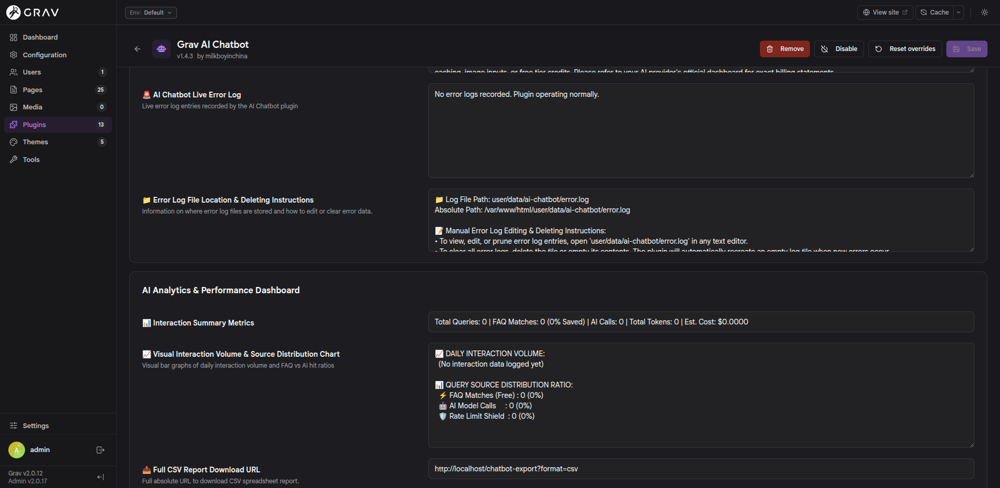

# Admin2 Analytics & Live Log Compatibility Report

**Plugin**: `grav-plugin-ai-chatbot`  
**Panel**: Grav Admin2 (`user/plugins/admin2`)  
**Date**: August 1, 2026  

---

## Environment & System Context

- **CMS Platform**: Grav CMS `v2.0.12`
- **Admin Interface**: Grav Admin2 SvelteKit SPA `v2.0.17` (`user/plugins/admin2`) alongside Classic Admin (`user/plugins/admin`)
- **API Engine**: `grav-plugin-api` (`>=1.0.14`)
- **PHP Version**: PHP `8.3.32`
- **Webserver**: Apache `2.4.68` (Debian)
- **Operating System**: Debian GNU/Linux `13.6` (trixie/testing)
- **System Architecture**: `x86_64` (64-bit)
- **Container Environment**: Docker LAMP Stack (`grav-lamp-web`)
- **Active LLM Provider**: Local Ollama (`qwen2.5-fast:latest`)

---

## Affected Files & Code Locations in `ai-chatbot`

Below are the specific plugin files, blueprint definitions, and event listener methods affected by the Admin2 SPA form rendering behavior:

### 1. `blueprints.yaml` (Blueprint Definitions)
- **Location**: [`user/plugins/ai-chatbot/blueprints.yaml`](file:///home/milkboy/Documents/web-app/personal-cv-site/user/plugins/ai-chatbot/blueprints.yaml#L581-L630)
- **Affected Fields**:
  - `ai_chatbot_error_log_display`: Live system error log textarea (`type: textarea`, `ignore: true`).
  - `regenerate_metrics_button`: Embedded inline JavaScript poller (`content: '<script>(function(){ doPoll()... })()</script>'`).
  - `analytics_summary_text`: Real-time query summary metrics field (`type: text`, `ignore: true`).
  - `analytics_chart_display`: Visual ASCII volume bar graph textarea (`type: textarea`, `ignore: true`).
  - `analytics_recommendations_text`: Candidate FAQ recommendations textarea (`type: textarea`, `ignore: true`).

### 2. `ai-chatbot.php` (PHP Plugin Event Listeners)
- **Location**: [`user/plugins/ai-chatbot/ai-chatbot.php`](file:///home/milkboy/Documents/web-app/personal-cv-site/user/plugins/ai-chatbot/ai-chatbot.php#L100-L320)
- **Affected Methods**:
  - `onBlueprintCreated($event)`: Injects dynamic metrics and error logs into `$blueprint` for Classic Admin rendering.
  - `onApiBlueprintResolved($event)`: Injects dynamic metrics and error logs into `$event['fields']` array for Admin2 REST API responses (`GET /api/v1/blueprints/plugins/ai-chatbot`).

---

## Live Browser Inspection vs Expected Data

When I open the AI Chatbot settings inside Admin2 (`http://localhost/admin/plugins/ai-chatbot`), three form fields display static placeholder text instead of live logged stats:



### 1. 📊 Interaction Summary Metrics (`analytics_summary_text`)
- **What Admin2 Displays on Screen**:
  `Total Queries: 0 | FAQ Matches: 0 (0% Saved) | AI Calls: 0 | Total Tokens: 0 | Est. Cost: $0.0000`
- **Actual Live Data (What it should display)**:
  `Total Queries: 59 | FAQ Matches: 24 (41% Saved) | AI Calls: 10 | Total Tokens: 4,827 | Est. Cost: $0.0009`

---

### 2. 📈 Visual Interaction Volume & Source Distribution Chart (`analytics_chart_display`)
- **What Admin2 Displays on Screen**:
  `DAILY INTERACTION VOLUME: (No interaction data logged yet)...`
- **Actual Live Data (What it should display)**:
  ```text
  📈 DAILY INTERACTION VOLUME:
    2026-07-29 : ███████████ (13 queries)
    2026-07-30 : ████████████████████ (24 queries)
    2026-07-31 : ██████████ (12 queries)
    2026-08-01 : ████████ (10 queries)

  📊 QUERY SOURCE DISTRIBUTION RATIO:
    ⚡ FAQ Matches (Free) : ████████ 24 (41%)
    🤖 AI Model Calls     : ███ 10 (17%)
    🛡️ Rate Limit Shield  :  0 (0%)
  ```

---

### 3. 🚨 AI Chatbot Live Error Log (`ai_chatbot_error_log_display`)
- **What Admin2 Displays on Screen**:
  `No error logs recorded. Plugin operating normally.`
- **Actual Live Data (What it should display)**:
  ```text
  [2026-08-01 09:00:43 +00:00] [ERROR] [CONFIG_DEBUG] LIVE_CONFIG_DUMP: {"enabled":true,"ai_enabled":true,"provider":"ollama","model":"qwen2.5-fast:latest","custom_endpoint":"http://localhost:11434/","rag_enabled":true,"faq_enabled":true,"rate_limit_enabled":true,"export_allowed_users":"admin","session_retention_days":7,"logging_enabled":true}
  [2026-08-01 09:01:29 +00:00] [ERROR] [CONFIG_DEBUG] LIVE_CONFIG_DUMP: {"enabled":true,"ai_enabled":true,"provider":"ollama","model":"qwen2.5-fast:latest","custom_endpoint":"http://localhost:11434/","rag_enabled":true,"faq_enabled":true,"rate_limit_enabled":true,"export_allowed_users":"admin","session_retention_days":7,"logging_enabled":true}
  [2026-08-01 10:36:29 +00:00] [ERROR] [CONFIG_DEBUG] LIVE_CONFIG_DUMP: {"enabled":true,"ai_enabled":true,"provider":"ollama","model":"qwen2.5-fast:latest","custom_endpoint":"http://localhost:11434/","fallback_endpoint":"http://127.0.0.1:11434/","rag_enabled":true,"faq_enabled":true,"rate_limit_enabled":true,"export_allowed_users":"admin","session_retention_days":7,"logging_enabled":true}
  [2026-08-01 10:42:59 +00:00] [ERROR] [CONFIG_DEBUG] LIVE_CONFIG_DUMP: {"enabled":true,"ai_enabled":true,"provider":"ollama","model":"qwen2.5-fast:latest","custom_endpoint":"http://localhost:11434/","fallback_endpoint":"http://127.0.0.1:11434/","rag_enabled":true,"faq_enabled":true,"rate_limit_enabled":true,"export_allowed_users":"admin","session_retention_days":7,"logging_enabled":true}
  ```

---

## Why Doesn't the Text Update Live in Admin2?

> **Disclaimer & Technical Context**:  
> Please note that the explanations below represent my **primary technical suspicion** based on browser debugging and API response analysis. Since I have limited hands-on experience with SvelteKit internals and `grav-plugin-admin2` frontend architecture, the exact DOM rendering pipeline in Admin2 may behave slightly differently under the hood.

1. **SvelteKit Strips Inline Scripts**: In classic Grav Admin, an inline `<script>` poller in `blueprints.yaml` (`doPoll()`) updated `<textarea>` fields in the DOM every 2 seconds. Admin2 is built as a SvelteKit SPA, which strips out inline `<script>` tags from form blueprints for security (XSS prevention).
2. **Form State Binding**: Admin2 binds form field state to `user/config/plugins/ai-chatbot.yaml`. Because analytics fields are marked `ignore: true` (so metrics aren't saved into config files on save), Admin2 renders static default strings on screen.

---

## Current Non-Optimal Workarounds

While embedded form textareas inside Admin2's settings page remain static due to SPA script sanitization, I don't need to wait for Admin2 core updates. I can access all live telemetry, metrics, and error logs right now using these practical workarounds:

1. **Live REST Data Export Links**:
   Access real-time generated telemetry data directly via standalone URL endpoints in my browser:
   - **CSV Spreadsheet Export**: `http://localhost/chatbot-export?format=csv`
   - **JSON Telemetry Dataset**: `http://localhost/chatbot-export?format=json`
   - **Raw Interactions Stream**: `http://localhost/chatbot-export?format=raw_interactions`
2. **Direct File System Log Inspection**:
   - View raw query logs at `user/data/ai-chatbot/interactions.json`.
   - View system error logs at `user/data/ai-chatbot/error.log`.
3. **Backend Blueprint Event Resolver**:
   I subscribed `onApiBlueprintResolved` in `ai-chatbot.php` so all REST API requests dynamically receive calculated query metrics and ASCII graphs in the backend JSON payload.
4. **Classic Admin View**:
   If live inline ASCII bar graphs and real-time form text updates are needed directly on screen, I can access the plugin page via Classic Admin (`user/plugins/admin`) where inline JavaScript polling operates freely.

---

## Recommendations for the Grav Admin2 Core Team

> **Note**: I have no hands-on experience building SvelteKit SPAs. The suggestions below represent my basic understanding from reading online documentation and developer guides, so these ideas might be incomplete, sub-optimal, or incorrect.

Here are suggestions and reference examples for the `grav-plugin-admin2` developers to help third-party plugins render dynamic live metrics cleanly in future releases:

### 1. Hydrate Form Defaults from `onApiBlueprintResolved`
Ensure Svelte form controls bind initial state to the resolved `$event['fields']` default values returned by backend PHP event listeners in [`grav-plugin-api`](https://github.com/getgrav/grav-plugin-api).
- **Supporting Documentation**:
  - Grav API `BlueprintController` Source Code: [`grav-plugin-api/BlueprintController.php`](https://github.com/getgrav/grav-plugin-api/blob/develop/classes/Api/Controllers/BlueprintController.php)
  - Grav Official Event Hooks Documentation: [`learn.getgrav.org/17/plugins/event-hooks`](https://learn.getgrav.org/17/plugins/event-hooks)

### 2. Add a Native Polling Field Type (`type: dynamic_metrics`)
Introduce a native blueprint field type in Admin2 (e.g. `type: dynamic_metrics` or `type: api_fetch`) that accepts an API endpoint URL (`endpoint: /api/v1/...`) and polls it safely within Svelte SPA reactive state (`bind:value`), avoiding inline scripts entirely.  
- **Supporting Documentation**:
  - Svelte Form Data Binding & Reactive State Docs: [`svelte.dev/docs/svelte/bind`](https://svelte.dev/docs/svelte/bind)

### 3. Web Component / UI Slot Registry
Provide a JavaScript extension API allowing third-party plugins to register custom Svelte components or Web Components inside admin form tabs.
- **Supporting Documentation & Specifications**:
  - MDN Web Components & Custom Elements Guide: [`developer.mozilla.org/Web/API/Web_components`](https://developer.mozilla.org/en-US/docs/Web/API/Web_components)
  - Svelte Custom Elements Specification: [`svelte.dev/docs/svelte/custom-elements`](https://svelte.dev/docs/svelte/custom-elements)
  - Grav Admin2 Repository: [`github.com/getgrav/grav-plugin-admin2`](https://github.com/getgrav/grav-plugin-admin2)
  - Grav Admin2 Issue Tracker & RFCs: [`github.com/getgrav/grav-plugin-admin2/issues`](https://github.com/getgrav/grav-plugin-admin2/issues)
