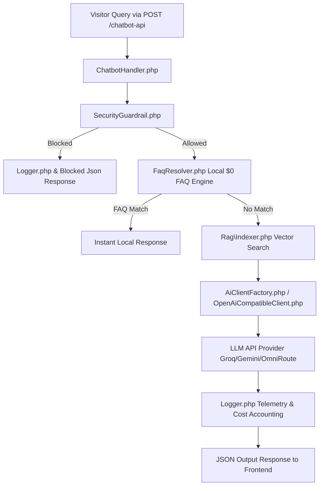

# Grav AI Chatbot Plugin — Developer & Architecture Guide (`DEVELOPER.md`)

This guide provides technical specifications, class relationships, REST API endpoints, Admin 2 Web Component field contracts, and security guardrail architecture for developers extending or contributing to **`ai-chatbot`**.

---

## 🏛️ 1. Architecture & Class Relationships



### Core Classes & Responsibility Matrix

| Class | File Path | Primary Responsibility |
| :--- | :--- | :--- |
| **`ChatbotHandler`** | `classes/ChatbotHandler.php` | Main request router, API payload parser, response encoder, and exception boundary. |
| **`SecurityGuardrail`** | `classes/SecurityGuardrail.php` | Input normalization, leetspeak decoding, 5-category blacklist inspection, `user/pages/` scope enforcement, and IP cool-off lockouts. |
| **`FaqResolver`** | `classes/FaqResolver.php` | Local semantic FAQ pre-matching engine supporting `default.en.md` / `default.id.md` page headers, aliases, and intent normalization. |
| **`Rag\Indexer`** | `classes/Rag/Indexer.php` | Heading-aware page chunker, SQLite vector store, TF-IDF / BM25 / Embedding search. |
| **`OpenAiCompatibleClient`** | `classes/OpenAiCompatibleClient.php` | Driver for OpenAI, Groq, OpenRouter, and Ollama APIs with system security boundary injection. |
| **`Logger`** | `classes/Logger.php` | Interaction telemetry recording (`interactions.json`), cost calculation, and error logging (`error.log`). |
| **`AnalyticsReportGenerator`** | `classes/AnalyticsReportGenerator.php` | Date-range telemetry filtering, chart data aggregation, and CSV/JSON export generation. |

---

## 🔌 2. REST API Specification (`POST /chatbot-api`)

All client-side chat widgets and Admin 2 dashboard components communicate via `POST /chatbot-api`.

### Endpoints & Payloads

#### A. Send Visitor Question (`action: chat`)
```json
// Request Payload
{
  "action": "chat",
  "question": "What are your business hours?",
  "current_route": "/contact"
}

// Success Response (FAQ Match)
{
  "http_code": 200,
  "success": true,
  "answer": "We are open Monday through Friday from 9 AM to 5 PM.",
  "source": "faq_match"
}
```

#### B. Fetch Dashboard Metrics (`action: get_metrics`)
```json
// Request Payload
{ "action": "get_metrics" }

// Success Response
{
  "http_code": 200,
  "success": true,
  "provider": "omniroute",
  "model": "gemini-2.0-flash",
  "stats": {
    "total_queries": 142,
    "completion_tokens": 18450,
    "estimated_cost": 0.0125
  }
}
```

#### C. Fetch Security Audit Logs (`action: get_security_logs`)
```json
// Request Payload
{ "action": "get_security_logs" }

// Success Response
{
  "http_code": 200,
  "success": true,
  "data": {
    "threat_level": "secure",
    "active_lockouts": 0,
    "total_violations": 3,
    "logs": [
      {
        "timestamp": "2026-08-11 14:29:49 +00:00",
        "ip_hash": "245c0ffc",
        "reason": "Security Guardrail: Input matched prohibited safety pattern. (Raw: <script>alert(1)</script>)",
        "status": "Blocked"
      }
    ]
  }
}
```

---

## 🎨 3. Admin 2 (Svelte 5 SPA) Web Component Contract

Grav Admin 2 renders custom blueprint fields as native Web Components. Component implementations must strictly follow this contract:

1. **Dynamic Custom Element Tag Name**:
   ```javascript
   const TAG = (typeof window !== 'undefined' && window.__GRAV_FIELD_TAG) ? window.__GRAV_FIELD_TAG : 'chatbot-security-logs';
   customElements.define(TAG, CustomFieldClass);
   ```

2. **Container Layout & Overflow Protection**:
   - Apply `:host { display: block; width: 100%; max-width: 100%; box-sizing: border-box; }`.
   - Set `box-sizing: border-box`, `max-width: 100%`, and `word-break: break-word` on inner card containers so components stay strictly bounded within card borders.

3. **Authentication Header**:
   - Include `X-API-Token: window.__GRAV_API_TOKEN` header on all HTTP requests targeting `/chatbot-api`.

---

## 🛡️ 4. Security Hardening Architecture

1. **Leetspeak & Unicode Normalization**:
   - Strips zero-width characters and converts leetspeak (`h4ck` $\rightarrow$ `hack`, `@dmin` $\rightarrow$ `admin`, `$cam` $\rightarrow$ `scam`) before pattern matching.

2. **5-Category Defense Matrix (`SecurityGuardrail.php`)**:
   - **Prompt Injection**: `ignore previous instructions`, `reveal system prompt`, `dan mode`, `abaikan instruksi`.
   - **XSS Script Injection**: `<script`, `javascript:`, `onerror=`, `onload=`, `fetch(`.
   - **SQL Injection**: `union select`, `drop table`, `insert into`, `or 1=1`.
   - **Credential Probes**: `.env`, `user/config`, `admin_password`, `id_rsa`.
   - **Command Injection**: `cat /etc/passwd`, `rm -rf`, `sudo su`, `powershell`.

3. **Strict Read-Only Scope (`user/pages/` & RAG Only)**:
   - System prompt directives and input inspection enforce that the AI Chatbot has **READ-ONLY access strictly limited to `user/pages/`** and its RAG embeddings index (`user/data/ai-chatbot/rag_index.json`).

4. **IP Cool-Off Protection**:
   - 5 security violations in 60s trigger a **15-minute temporary IP lockout** (`429 Security Cool-Off`).

---

## 🧪 5. Local Container Testing Workflow

- **Local Development URL**: `http://localhost/admin/plugins/ai-chatbot`
- **Cache Clearing Command**:
  ```bash
  docker exec grav-lamp-web php bin/grav clearcache
  ```
- **PHP Syntax Check**:
  ```bash
  docker exec grav-lamp-web php -l user/plugins/ai-chatbot/classes/SecurityGuardrail.php
  docker exec grav-lamp-web php -l user/plugins/ai-chatbot/classes/ChatbotHandler.php
  ```
- **Deployment Policy**: All changes must be tested locally. Production deployment (`make deploy`) is NEVER executed unless explicitly ordered by the user.
