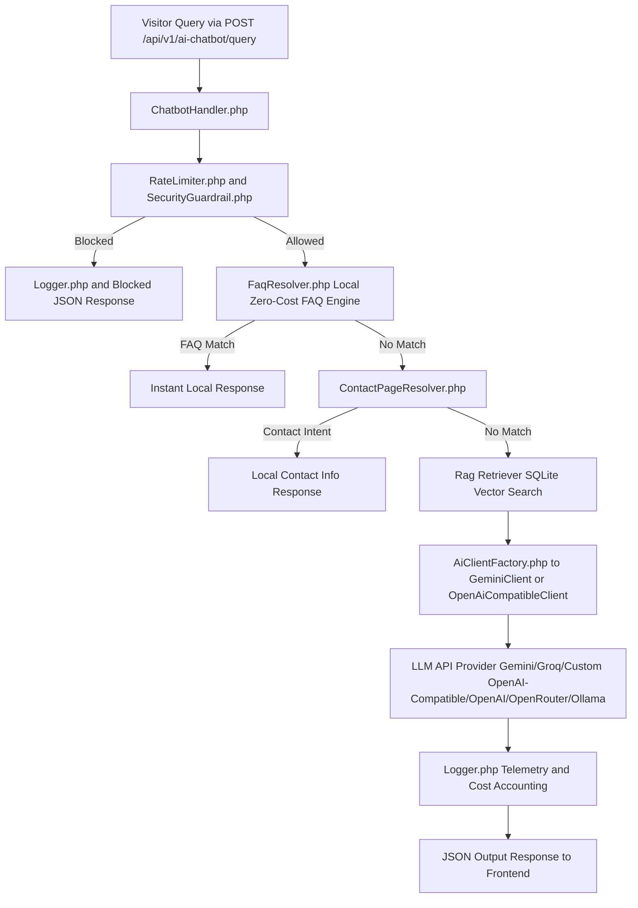

# Grav AI Chatbot Plugin — Developer & Architecture Guide (`DEVELOPER.md`)

This guide provides technical specifications, class relationships, REST API endpoints, Admin 2 Web Component field contracts, and security guardrail architecture for developers extending or contributing to **`ai-chatbot`**.

---

## 🏛️ 1. Architecture & Class Relationships


```mermaid
graph TD
    A[Visitor Query via POST /api/v1/ai-chatbot/query] --> B[ChatbotHandler.php]
    B --> C[RateLimiter.php and SecurityGuardrail.php]
    C -->|Blocked| D[Logger.php and Blocked JSON Response]
    C -->|Allowed| E[FaqResolver.php Local Zero-Cost FAQ Engine]
    E -->|FAQ Match| F[Instant Local Response]
    E -->|No Match| E2[ContactPageResolver.php]
    E2 -->|Contact Intent| F2[Local Contact Info Response]
    E2 -->|No Match| G[Rag Retriever SQLite Vector Search]
    G --> H[AiClientFactory.php to GeminiClient or OpenAiCompatibleClient]
    H --> I[LLM API Provider Gemini/Groq/Custom OpenAI-Compatible/OpenAI/OpenRouter/Ollama]
    I --> J[Logger.php Telemetry and Cost Accounting]
    J --> K[JSON Output Response to Frontend]
```

### Core Classes & Responsibility Matrix

| Class | File Path | Primary Responsibility |
| :--- | :--- | :--- |
| **`ChatbotHandler`** | `classes/ChatbotHandler.php` | Main request router, API payload parser, response encoder, and exception boundary. |
| **`SecurityGuardrail`** | `classes/SecurityGuardrail.php` | Input normalization, leetspeak decoding, 5-category blacklist inspection, `user/pages/` scope enforcement, and IP cool-off lockouts. |
| **`FaqResolver`** | `classes/FaqResolver.php` | Local semantic FAQ pre-matching engine supporting `default.en.md` / `default.id.md` page headers, aliases, and intent normalization. |
| **`ContactPageResolver`** | `classes/ContactPageResolver.php` | Resolves contact intents against public `/contact` and hidden `/hidden-contacts` pages. |
| **`Rag\Indexer`** | `classes/Rag/Indexer.php` | Heading-aware page chunker and embedding writer to the SQLite vector store; incremental SHA-256 hashing. |
| **`Rag\Retriever`** | `classes/Rag/Retriever.php` | Similarity search over the SQLite vector store; returns Top-K chunks for the prompt. |
| **`RateLimiter`** | `classes/RateLimiter.php` | Per-IP rolling-window request limiting backed by Grav cache. |
| **`AiClientFactory`** | `classes/AiClientFactory.php` | Selects the concrete AI client (`GeminiClient` or `OpenAiCompatibleClient`) from provider config. |
| **`OpenAiCompatibleClient`** | `classes/OpenAiCompatibleClient.php` | Driver for OpenAI, Groq, OpenRouter, Custom OpenAI-Compatible, and Ollama APIs with system security boundary injection. |
| **`Logger`** | `classes/Logger.php` | Interaction telemetry recording (`interactions.json`), cost calculation, and error logging (`error.log`). |
| **`AnalyticsReportGenerator`** | `classes/AnalyticsReportGenerator.php` | Date-range telemetry filtering, chart data aggregation, and CSV/JSON export generation. |

---

## 🔌 2. REST API Specification (`/api/v1/ai-chatbot/*`)

All modern client-side chat widgets and Admin 2 dashboard components communicate via the Grav 2.0 REST API endpoints registered under `/api/v1/ai-chatbot/*`.

### Endpoints & Permissions Matrix

| Method | Path | Auth | Purpose |
|---|---|---|---|
| POST | `/ai-chatbot/query` | public | Visitor question. Body: `question`, `history[]`, `current_route`, optional `action: force_ai`. |
| POST | `/ai-chatbot/summarize` | public | Page summary. Body: `current_route`. |
| GET | `/ai-chatbot/metrics` | `api.system.read` | Dashboard metrics and analytics. |
| GET | `/ai-chatbot/logs?per_page=` | `api.system.read` | Paginated interactions. |
| GET | `/ai-chatbot/security` | `api.system.read` | Threat audit data. |
| GET | `/ai-chatbot/export?format=csv\|json\|raw_interactions` | `api.system.read` | File download. |
| POST | `/ai-chatbot/test-key`, `/models`, `/health` | `api.system.write` | Provider tools (Admin2 model-tools). |
| POST | `/ai-chatbot/reindex` | `api.system.write` | Rebuild RAG index. |
| POST | `/ai-chatbot/unlock` | `api.system.write` | Release IP lockouts. |

All responses use the `{ "data": { ... } }` JSON envelope.

### Legacy Shim (`/chatbot-api`)
The legacy `/chatbot-api` endpoint is **deprecated** and maintained as a fallback for the public chat widget. It serves visitor queries only (`query`, `summarize_page`). All administrative actions (`get_metrics`, `test_api_key`, `fetch_models`, etc.) return `HTTP 403 Forbidden` and must use the REST API with `X-API-Token`. Planned for complete removal in version 3.0.0.

---

## 🎨 3. Admin 2 (Svelte 5 SPA) Web Component Contract

Grav Admin 2 renders custom blueprint fields as native Web Components. Component implementations must strictly follow this contract:

1. **Dynamic Custom Element Tag Name**:
   ```javascript
   const TAG = (typeof window !== 'undefined' && window.__GRAV_FIELD_TAG) ? window.__GRAV_FIELD_TAG : 'chatbot-model-tools';
   customElements.define(TAG, CustomFieldClass);
   ```

2. **Outer Shadow DOM Traversal (`_deepQueryOuter`)**:
   - Web Components must query outer document shadow roots using `_deepQueryOuter(selector, root)` while explicitly excluding `this` and `this.shadowRoot` to avoid matching internal component elements (such as hint banners containing target field text).
   - Target input finders (`_findTargetInputs`) must return strictly **1 single target input element** (`[found[0]]`) with negative attribute filters (`!fieldAttr.includes('operations')`) to prevent field overwrite collisions.

3. **3-Level Live Provider Detector Contract**:
   - Detects unsaved dropdown options across 3 fallback levels: (1) Direct select value/index, (2) `"AI Provider Engine"` label proximity, (3) Option text keywords (`"groq"`, `"openrouter"`, `"openai"`, `"gemini"`, `"ollama"`, `"custom"`/`"omniroute"`).

4. **Container Layout & Overflow Protection**:
   - Apply `:host { display: block; width: 100%; max-width: 100%; box-sizing: border-box; }`.
   - Set `box-sizing: border-box`, `max-width: 100%`, and `word-break: break-word` on inner card containers so components stay strictly bounded within card borders.

5. **Authentication Header & API Key Security**:
   - Include `X-API-Token: window.__GRAV_API_TOKEN` header on all HTTP requests targeting `/api/v1/ai-chatbot/*`.
   - **API Key Confidentiality**: `api_key` is processed strictly server-to-server via PHP cURL and is **NEVER** exposed to client JS, HTML DOM attributes, or disk error log files.

---

## 🛡️ 4. Security Hardening Architecture

1. **Leetspeak & Unicode Normalization**:
   - Strips zero-width characters and converts leetspeak (`h4ck` $\rightarrow$ `hack`, `@dmin` $\rightarrow$ `admin`, `$cam` $\rightarrow$ `scam`) before pattern matching.

2. **5-Category Defense Matrix (`SecurityGuardrail.php`)**:
   - **Prompt Injection**: `ignore previous instructions`, `reveal system prompt`, `dan mode`, `abaikan instruksi`.
   - **XSS Script Injection**: `<script`, `javascript:`, `onerror=`, `onload=`, `fetch(`.
   - **SQL Injection**: `union select`, `drop table`, `insert into`, `or 1=1`.
   - **Credential Probes**: `.env`, `user/config`, `admin_password`, `id_rsa`.
   - **Command Injection**: `cat /etc/passwd`, `rm -rf`, `sudo su`, `powershell`.

3. **Strict Read-Only Scope (`user/pages/` & RAG Only)**:
   - System prompt directives and input inspection enforce that the AI Chatbot has **READ-ONLY access strictly limited to `user/pages/`** and its RAG embeddings index (`user/data/ai-chatbot/rag_index.sqlite`).

4. **IP Cool-Off Protection**:
   - 5 security violations in 60s trigger a **15-minute temporary IP lockout** (`429 Security Cool-Off`).

---

## 🧪 5. Local Container Testing Workflow

- **Local Development URL**: `http://localhost:18888/admin/plugins/ai-chatbot`
- **Cache Clearing Command**:
  ```bash
  docker exec grav-lamp-web php bin/grav clearcache
  ```
- **PHP Syntax Check**:
  ```bash
  docker exec grav-lamp-web php -l user/plugins/ai-chatbot/classes/SecurityGuardrail.php
  docker exec grav-lamp-web php -l user/plugins/ai-chatbot/classes/ChatbotHandler.php
  docker exec grav-lamp-web php -l user/plugins/ai-chatbot/classes/Controllers/ChatbotApiController.php
  ```
- **YAML Syntax Check**:
  ```bash
  docker exec grav-lamp-web php vendor/bin/yaml-lint user/plugins/ai-chatbot/blueprints.yaml
  ```
- **Deployment Policy**: All changes must be tested locally. Production deployment (`make deploy`) is NEVER executed unless explicitly ordered by the user.
