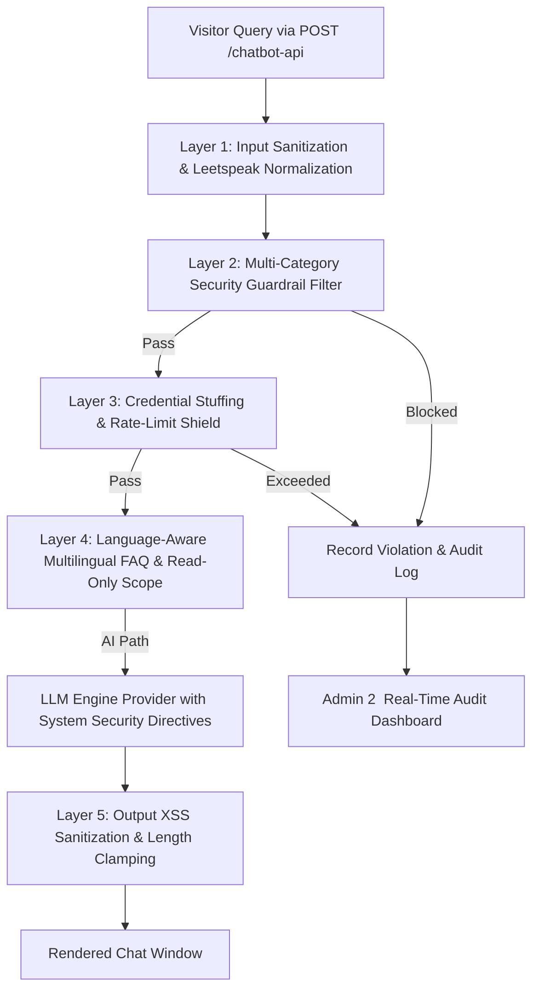

# Security Policy (`SECURITY.md`)

This document outlines the security policy, threat model, vulnerability reporting procedures, and security architecture for the **Grav CMS AI Chatbot Plugin** (`ai-chatbot`).

---

## 📋 Supported Versions

We actively maintain and provide security patches for the following versions:

| Version | Supported | Notes |
| :--- | :--- | :--- |
| **1.5.x** | ✅ Yes | Current stable release with multi-layered security guardrails. |
| **1.4.x** | ⚠️ Critical Security Only | Upgrades to 1.5.x recommended for Admin 2 security dashboards. |
| **< 1.4.0** | ❌ No | Deprecated. Please upgrade to the latest version immediately. |

---

## 🔒 Reporting a Vulnerability

We take the security of our plugin and its users seriously. If you discover a security vulnerability, prompt injection bypass, or potential exploit, **please do not create a public issue**.

### Reporting Procedure

1. **Private GitHub Security Advisory**:
   - Navigate to the **[Security tab](https://github.com/milkboyinchina/grav-ai-chatbot/security)** on GitHub.
   - Click **"Report a vulnerability"** to submit a private report.
2. **Email Disclosure**:
   - Alternatively, email the maintainer directly with details of the vulnerability.

### Response Timeline
- **Acknowledgement**: Within 48 hours of report submission.
- **Triage & Validation**: Within 5 business days.
- **Security Patch Release**: Critical vulnerabilities will receive an expedited patch release within 14 days.

---

## 🛡️ Security Architecture & Threat Model

The plugin incorporates a 5-layer defense-in-depth perimeter designed to protect Grav CMS sites against LLM threat vectors:

### Key Security Layers

1. **Leetspeak & Unicode Normalization**:
   - Strips zero-width characters and converts leetspeak obfuscations (`h4ck` $\rightarrow$ `hack`, `byp4ss` $\rightarrow$ `bypass`, `@dmin` $\rightarrow$ `admin`) before evaluation.
2. **5-Category Defense Matrix (`SecurityGuardrail.php`)**:
   - **Prompt Injections & Jailbreaks**: Detects and blocks `ignore previous instructions`, `reveal system prompt`, `dan mode`, `developer mode`, `abaikan instruksi`.
   - **Script Injection (XSS)**: Blocks `<script`, `javascript:`, `onerror=`, `onload=`, `eval(`, `fetch(`.
   - **SQL Injection**: Blocks `union select`, `drop table`, `insert into`, `or 1=1`, `; --`.
   - **Credential Probes**: Blocks probes targeting `.env`, `user/config`, `admin_password`, `secret_token`, `id_rsa`.
   - **System Commands**: Blocks `cat /etc/passwd`, `rm -rf`, `chmod 777`, `sudo su`, `/bin/bash`.
3. **Strict Read-Only Knowledge Scope (`user/pages/` & RAG Only)**:
   - System prompt directives and input inspection restrict the AI Chatbot's access **STRICTLY to read-only content from `user/pages/`** and its RAG embeddings index (`user/data/ai-chatbot/rag_index.json`). The chatbot has zero access to server files, credentials, or `user/config/`.
4. **Credential Stuffing & IP Cool-Off Protection**:
   - Tracks security guardrail violations per anonymized IP hash (`substr(hash('sha256', $ip . $salt), 0, 16)`). 5 violations within 60s trigger a **15-minute temporary IP lockout** (`429 Security Cool-Off`).
5. **Output XSS Encoding & Length Clamping**:
   - Server-side input query truncation (**Max 500 characters**), HTML output encoding in `chatbot.js`, and URL scheme validation (`http://`, `https://`, `/`).

---

## 🛠️ Security Best Practices for Site Administrators

1. **Keep Grav & PHP Updated**: Ensure your web server runs PHP 8.3+ and Grav CMS 2.0+.
2. **Enable Blacklisted Words Filter**: Maintain `blacklist_filter_enabled: true` in plugin configuration.
3. **Restrict Export Downloads**: Enable `export_require_auth: true` and specify whitelisted usernames (`export_allowed_users`) allowed to download interaction logs.
4. **Monitor Admin 2 Security Logs**: Periodically review the `<chatbot-security-logs>` card in Grav Admin 2 to audit blocked threat attempts and active IP lockouts.
